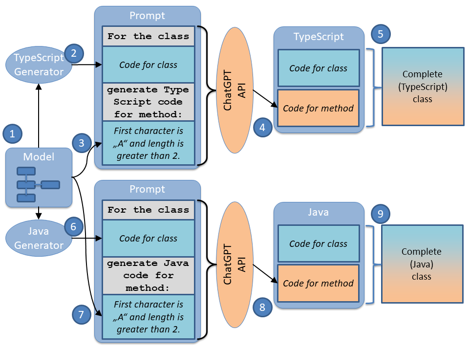

# GPT Generator

Application that automatically sends prompts to ChatGPT and stores the replies as source code.

* Files whose name ends with ".prompt" are sent to ChatGPT. The response is saved with ".prompt" removed from the file name.
* Files whose name ends with ".fragment" are merged into other files

## Workflow

### Workflow for one target language


1. Create a model in MPS
2. Generate the code for the class
3. Write a template file that combines the code for the class with the description for a method into a prompt for ChatGPT
4. GPTGenerator sends the prompt to the ChatGPT API and stores the result as the code for the method
5. GPTGenerator merges the code for the class with the code for the method to generate the complete (TypeScript) class

### Workflow for two target languages

This mechanism is especially useful if you want to generate more than one target language.

You add another generator, e.g. for Java. 

6. The generator creates the class code in Java
7. Write a template file that combines the code for the class with the description for a method into a prompt for ChatGPT
8. GPTGenerator sends the prompt to the ChatGPT API and stores the result as the code for the method
9. GPTGenerator merges the code for the class with the code for the method to generate the complete (Java) class




## Running the application

```
java -cp gptgenerator.jar gptgenerator.app.AppMain
```

## Running the application without GUI (headless)
```
java -cp gptgenerator.jar gptgenerator.app.AppMain --nogui
```

### Specifying the path to the configuration file
You can specify the path to the configuration file with the parameter --config

Per default the application will look for the configuration file in the current directory. 