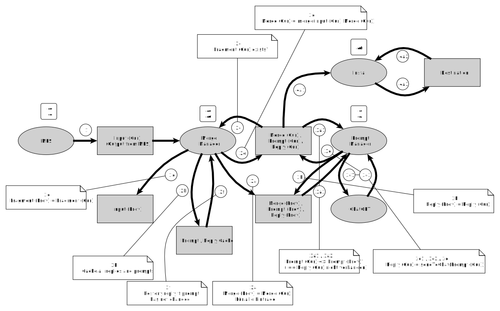
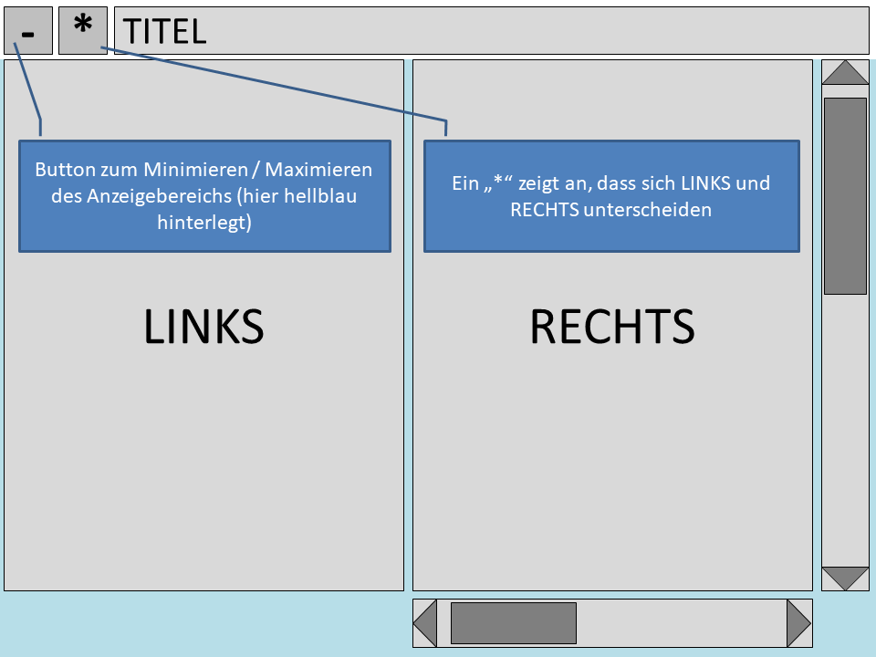
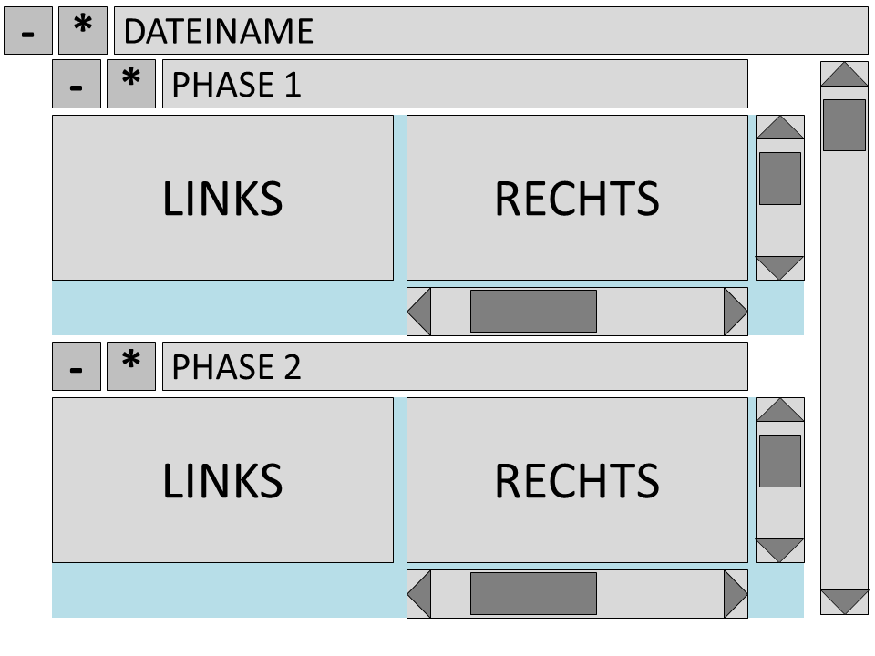

<header>
<title>Anforderungen AppGenerator UI</title>
</header>

<!--
Aufruf: mdconverter Anforderungen-AppGeneratorUI.md
--->

# Einleitung

Eine minimales System für die Generierung mittels ChatGPT und der Installation der erzeugten Sourcen.

# Übersicht AppModel

## Ordnerstruktur

Wünsche:

- einfache, kurze und verständliche Dateinamen

- unterscheiden können zwischen "prompt" und "reply"

- Die folgenden Vergleiche sollen einfach möglich sein:

  - Gibt es einen Unterschied zwischen "cur" und "prev" (rekursiv)?
  
  
### Konvention in MPS output:

Es gibt keine separaten Verzeichnisse für Template, Fragment und Prompt.

* Der Dateinamen von Prompts endet auf ".prompt". Dadurch wird sichergestellt, dass Prompts an ChatGPT gesendet werden. Für die Antwort von ChatGPT wird ".prompt" am Ende des Dateinamens entfernt. So wird ".fragment.prompt" zu ".fragment".
* Der Dateinamen von Fragmenten endet auf ".fragment". Dadurch wird sichergestellt, dass Fragmente nicht installiert werden.

### Ordnerstruktur im Projektverzeichnis:

Unterhalb des Verzeichnisses "processing":

| Ordner      | Erläuterung |
| ----------- | ----------- |
| inputPrev   | Die vorherige Version der Dateien, die in "MPS output" liegen |
| replyPrev   | Die aktuelle bzw. vorherige Version der Antworten von ChatGPT auf prompt/fileCur |
| mergeCur    | enthält auch Prompt (Cur) und Reply (Cur). Dateien nach dem Merge. Wenn eine Datei auf ".prompt" endet, wird sie vom PromptManager verarbeitet, und die Reply wird in diesem Verzeichnis abgelegt und erhält den Dateinamen ohne ".prompt". |
| mergePrev   | Die aktuelle bzw. vorherige Version der zusammengemischten Dateien |

## Der Ablauf

So wie der Ablauf skizziert ist, bietet es sich an, Generator und ChatGPT abwechselnd aufzurufen.

Wenn an einem Punkt weder Prompts vorliegen, die noch an ChatGPT geschickt werden können, noch Templates, die gemerged werden können, liegt ein Fehler vor.

Da viele (kleine) Dateien gelesen / geschrieben werden, bietet sich ein "write-through"-Cache an, um die Dateien im Hauptspeicher zu halten.
So kann man sehr schnell prüfen, ob eine Datei "vorhanden" ist.

- bestehende Dateien lesen und cachen
- neue Dateien schreiben und cachen

## MergeManager

## Hierarchie der Processor-Klassen/-Instanzen

## Die Verarbeitung im Überblick

### 1: Erzeugen durch MPS 

(1) MPS erzeugt die Dateien in "Template (Cur)"

### 2: Merge ausführen

### 2.1 Verzeichnisse vorbereiten und Prompt/Reply sichern
- (2a) Merge (Cur) nach Merge(Prev) sichern
- Alle Prompt- und Reply-Dateien in den Cache sichern
- Merge(Cur) löschen

### 2.2: Merge ausführen

Alle Dateien werden bei Merge durchlaufen und in Merge(Cur) gespeichert.

Ein Template kann erneut gemerged werden, wenn
- (2c): Alle Fragmente in (Merge (Cur) / Reply (Cur)) vorhanden sind

### 2.3: Reply wiederherstellen

Ein Reply wird wieder aus dem Cache hergestellt, wenn der Prompt im Cache und der Prompt in Merge(Cur) identisch sind.

Dann braucht man den Prompt nicht an ChatGPT zu schicken.

### 3: Prompt an ChatGPT schicken

Wenn kein Reply vorhanden ist, das Prompt an ChatGPT schicken und den Reply in Merge(Cur) ablegen

### 4: Datei installlieren

Wenn Größe oder Inhalt einer Datei in "Cur" und "Prev" nicht übereinstimmen, oder sie nicht in "Destination" existiert: Die Datei von "Cur" nach "Destination" kopieren. Dabei das Dateidatum aus "Cur" beibehalten.

## Dateivergleich

Die letzte Version einer Datei wird in "Prev" gesichert. Im Startbildschirm wird der Vergleich zwischen "Cur" und "Prev" dargestellt.

# Oberfläche

## Startbildschirm

Hier wird die Liste der Dateien angezeigt.

| Spalte | Wert        | Bedeutung |
| ------ | ----------- | ----------- |
| Input  | CHANGED     | Datei unterscheidet sich zwischen "MPS Output Dir" und "Template (Prev)" |
| Input  |             | Datei unterscheidet sich <b>nicht</b> zwischen "MPS Output Dir" und "Template (Prev)" |
| Input  | SRC MISSING | Datei ist in "Template (Prev)" aber <b>nicht</b> "MPS Output Dir" vorhanden |
| Merge  | PENDING     | Zu einer Datei in "MPS Output Dir" liegt ein Fragment noch nicht in "Merge (Cur)" vor |
| Merge  | CHANGED     | Datei unterscheidet sich zwischen "Merge (Cur)" und "Merge (Prev)" |
| Merge  |             | Datei unterscheidet sich <b>nicht</b> zwischen "Merge (Cur)" und "Merge (Prev)" |
| Merge  | N/A         | Datei in "MPS Output Dir" hat ".prompt" als Endung |
| Prompt | CHANGED     | Datei unterscheidet sich zwischen "Prompt (Cur)" und "Prompt (Prev)" |
| Prompt |             | Datei unterscheidet sich <b>nicht</b> zwischen "Prompt (Cur)" und "Prompt (Prev)" |
| Prompt | N/A         | Datei in "MPS Output Dir" hat nicht ".prompt" als Endung |
| Reply  | CHANGED     | Datei unterscheidet sich zwischen "Reply (Cur)" und "Reply (Prev)" |
| Reply  |             | Datei unterscheidet sich <b>nicht</b> zwischen "Reply (Cur)" und "Reply (Prev)" |
| Reply  | N/A         | Datei in "MPS Output Dir" hat nicht ".prompt" als Endung |

Die Dateien, bei denen ein Unterschied vorliegt, werden am Anfang der Liste sortiert angezeigt.

Danach folgt die Liste der nicht geänderten Dateien.

Ein Doppelklick auf eine Zeile zeigt für die entsprechende Datei die Anzeige von Cur und Prev an.

- Der Button "Process" startet den Generierungsvorgang
- Der Button "Process Selected" ist aktiv, wenn mindestens ein Eintrag ausgewählt ist. Nur die ausgewählten Einträge werden an den Generierungsvorgang übergeben.
- Der Button "Refresh" aktualisiert die Darstellung.
- Der Button "Configure" öffnet den Konfigurationsdialog: verschiedenen Installationskonfigurationen, das Projektverzeichnis, Prompt-Verzeichnis und Einstellungen für ChatGPT.
- Der Button "Sort" ändert die Sortierreihenfolge: Von "alphabetisch" auf "nach Status", und zurück.
- Der Button "Quit" beendet die Anwendung

## Entwicklung von Dateinamen

### Prompt-Dateien

| Verzeichnis  | Dateiname    | Erläuterung |
| ------------ | ------------ | ----------- |
| Input (Cur)  | Datei.prompt | Datei vor Merge |
| Input (Prev) | Datei.prompt | Datei vor Merge, vorherige Version |
| Merge (Cur)  | Datei.prompt | Datei nach Merge |
| Merge (Prev) | Datei.prompt | Datei nach Merge, vorherige Version |
| Merge (Cur)  | Datei        | Response-Datei zu Datei.prompt |
| Merge (Prev) | Datei        | Response-Datei zu Datei.prompt, vorherige Version |

### Nicht-Prompt-Dateien

| Verzeichnis  | Dateiname    | Erläuterung |
| ------------ | ------------ | ----------- |
| Input (Cur)  | Datei | Datei vor Merge |
| Input (Prev) | Datei | Datei vor Merge, vorherige Version |
| Merge (Cur)  | Datei | Datei nach Merge |
| Merge (Prev) | Datei | Datei nach Merge, vorherige Version |

## Anzeige der verschiedenen Versionen

### Vergleich zweier Datei-Versionen: CompareFilePanel

Das CompareFilePanel zeigt Cur und Prev einer Datei an.

Der Button in der linken oberen Ecke schaltet zwischen einer minimierten und einer maximierten Darstellung des blau hinterlegten Bereichs um.

Wenn also die Anzeige eines bestimmten Vergleichs nicht interessiert, kann er, bis auf die Titelzeile, ausgeblendet werden.

Die Scrollbars scrollen die linke und rechte Anzeige synchron.

Die <code>CompareFileView</code> zeigt ein <code>CompareFilePanel</code> für jede "Phase" in der Verarbeitung einer Datei an.
- Wenn im Startbildschirm in einer Spalte "N/A" steht, wird für diese Phase kein Dateivergleich angezeigt.
- Für die Phase "Merge" werden angezeigt:
  - "Merge (Cur)" und "Merge (Prev)"
  - für jedes eingebundene Fragment: "Merge (Cur)" und "Merge (Prev)"

### Vergleich mehrerer Phasen einer Datei: Mehrere CompareFilePanel

Hier liegt unter den verschiedenen <code>CompareFilePanel</code> Instanzen noch eine <code>ScrollArea</code>.

### Für Dateien die nicht auf ".prompt" enden

Dieser Dialog zeigt die folgenden Vergleiche an:
- die von MPS erzeugten Datei (aktuelle/vorherige Version)
- die Datei nach dem Merge (aktuelle/vorherige Version)

Wenn sich die Version vor und nach dem Merge <b>nicht</b> unterscheidet, wird der erste Vergleich (von MPS erzeugt) minimiert dargestellt.

Im Abschnitt "INCLUDED FILES" sind die Dateien aufgeführt, für die INCLUDE-Statements gefunden wurden.
In der Spalte <b>Status</b> wird der Vergleich der Datei zwischen "Merge (Cur)" und "Merge (Prev)" angezeigt.
Mit einem Doppelklick auf einen Eintrag wird eine Anzeige für die entsprechende Datei geöffnet.

### Für Dateien mit der Endung ".prompt"

Dieser Dialog zeigt drei Vergleiche (aktuelle/vorherige Version) an:
- die Eingabedatei (von MPS erzeugt)
- das Prompt (nach dem Merge)
- das ChatGPT Reply 

Wenn sich die Version vor und nach dem Merge <b>nicht</b> unterscheidet, wird der erste Vergleich (von MPS erzeugt) minimiert dargestellt.

Im Abschnitt "INCLUDED FILES" sind die Dateien aufgeführt, für die INCLUDE-Statements gefunden wurden.
In der Spalte <b>Status</b> wird der Vergleich der Datei zwischen "Merge (Cur)" und "Merge (Prev)" angezeigt.
Mit einem Doppelklick auf einen Eintrag wird eine Anzeige für die entsprechende Datei geöffnet.

## Konfigurationsdialog

So lange Felder einen ungültigen Inhalt haben, ist der "Save"-Button deaktiviert.

Der Dialog ist ein GridBagLayout mit drei Spalten.

Die Überschriften und die Tabelle belegen alle drei Spalten.

Die Buttons liegen in Panels, die alle drei Spalten belegen.

Bei den Eingabefeldern belegt die Fehlermeldung die dritte Spalte.

## Konfiguration für ein Quellverzeichnis

So lange Felder einen ungültigen Inhalt haben, ist der "Save"-Button deaktiviert.

# Testfälle
<!-- Tabelle wurde aus einem Excel-Sheet mittels eines VisualCode Plugins erzeugt -->

| Nr | Input(Cur)                                                       | Vergleich Input | Status Merge | Prompt ausgeführt? | Erläuterung                                                                                                                                                                                                                                                                                                                                                                     |
|----|------------------------------------------------------------------|---------------------|------------------|------------------------|---------------------------------------------------------------------------------------------------------------------------------------------------------------------------------------------------------------------------------------------------------------------------------------------------------------------------------------------------------------------------------|
| 1  |                                                                  | SRC MISSING         |                  | Nein                   | Eingabedatei nicht mehr vorhanden ("Vergleich Input" = SRC_MISSING): Datei wird aus Input(Prev), Merge (Cur), Merge (Prev) und INSTALL gelöscht                                                                                                                                                                                                                             |
| 2  | Input.java                                                       | CHANGED             |                  | Nein                   | Eine geänderte Eingabedatei wird ohne Merge kopiert                                                                                                                                                                                                                                                                                                                             |
| 3  | Input.java                                                       | DST MISSING         |                  | Nein                   | Eine neue Eingabedatei wird ohne Merge kopiert                                                                                                                                                                                                                                                                                                                                  |
| 4  | Input.java                                                       | UNCHANGED           |                  | Nein                   | Eine nicht geänderte Eingabedatei wird ohne Merge kopiert                                                                                                                                                                                                                                                                                                                       |
| 5  |                                                                  | SRC MISSING         |                  | Nein                   | Eingabedatei nicht mehr vorhanden ("Vergleich Input" = SRC_MISSING): Input.java wird aus Input(Prev), Merge (Cur) und Merge (Prev) gelöscht Input.java.fragment wird aus Input(Prev), Merge (Cur), Merge (Prev) und INSTALL gelöscht                                                                                                                                    |
| 6  | Input.java Input.java.fragment                               | CHANGED             |                  | Nein                   | Eine geänderte Eingabedatei wird mit Merge erstellt                                                                                                                                                                                                                                                                                                                             |
| 7  | Input.java Input.java.fragment                               | DST MISSING         |                  | Nein                   | Eine neue Eingabedatei wird mit Merge erstellt                                                                                                                                                                                                                                                                                                                                  |
| 8  | Input.java Input.java.fragment                               | UNCHANGED           |                  | Nein                   | Eine nicht geänderte Eingabedatei wird mit Merge erstellt                                                                                                                                                                                                                                                                                                                       |
| 9  |                                                                  | SRC MISSING         |                  | Nein                   | Eingabedatei nicht mehr vorhanden ("Vergleich Input" = SRC_MISSING): Input.java.prompt wird aus Input(Prev), Merge (Cur), Merge (Prev) und INSTALL gelöscht Input.java wird aus Input(Prev), Merge (Cur), Merge (Prev) und INSTALL gelöscht                                                                                                                             |
| 10 | Input.java.prompt                                                | DST MISSING         |                  | Ja                     |  Da keine Reply-Datei vorhanden ist: Eine neue Datei wird per Prompt transformiert                                                                                                                                                                                                                                                                                          |
| 11 | Input.java.prompt                                                | CHANGED             |                  | Ja                     | Da keine Reply-Datei vorhanden ist: Eine geänderte Datei wird per Prompt transformiert                                                                                                                                                                                                                                                                                      |
| 12 | Input.java.prompt                                                | UNCHANGED           | Input.java       | Nein                   | Da eine Reply-Datei vorhanden ist: Da sich das Prompt nicht geändert hat, wird es nicht erneut verarbeitet.                                                                                                                                                                                                                                                                 |
| 13 | addongetdto.model.ts addongetdto-check.model.fragment.prompt | CHANGED             |                  | Ja                     | 1. addongetdto-check.model.fragment.prompt wird nach Merge(Cur) gemerged 2.1 addongetdto-check.model.fragment.prompt wird an ChatGPT geschickt  2.2 addongetdto-check.model.fragment wird als Ergebnis in Merge(Cur) gespeichert 3. Da in Schritt 2.2 die erforderliche Include-Datei erstellt wurde, wird addongetdto.model.ts gemerged und in Merge(Cur) abgelegt |

# Gedankensammlung

# Anhang

## Begriffserläuterungen

| Begriff     | Erläuterung |
| ----------- | ----------- |
| Fragment | Ein Text, der in ein Template eingemischt wird. Der Unterschied zwischen einem Fragment und einem Prompt / einem Template: Ein Fragment wird *nicht* installiert. |
| Generation | Der vollständige Ablauf, vom Einlesen des Prompts, bis zum Kopieren der Reply in das Installationsverzeichnis. |
| Marker | Ein Platzhalter in einem Template. Der Marker enthält einen Verweis auf das Fragment, durch das der Marker ersetzt werden soll. |
| Model | Ein "Datenspeicher" |
| Number of threads | Die maximale Anzahl Threads für das Senden an ChatGPT |
| Prompt | Eine Anfrage, die an ChatGPT geschickt wird. Das Ergebnis ist eine installierbare Datei. |
| Reply | Die Antwort von ChatGPT. |
| Temperature | Der Wert "temperature", der an ChatGPT übergeben wird |
| Template | Eine Datei, in der Marker durch Fragmente ersetzt werden. Nach dem Ersetzen ist das Template zu einer "vollständigen" Datei geworden. |
| View | Eine Maske in der Oberfläche |

## Dokumentenänderungen

| Datum       | Änderung |
| ----------- | ----------- |
| 21.12.2023 | Angelegt |
| 22.12.2023 | Prozess und Vergleichsdialog detaillierter beschrieben |
| 25.12.2023 | Erweiterten Konfigurationsdialog beschrieben |
| 29.12.2023 | Den Mechanismus "Template und Marker" eingefügt. Grafiken überarbeitet. |
| 30.12.2023 | Layout und Beschreibung von "CompareFilePanel". Beschreibung eines Dependency-Management für Template/Fragment. Alle Dateien, die nicht als Prompt verwendet werden, werden gleich behandelt. |
| 02.05.2024 | Auf Visual Studio Code umgestellt: Die PlantUML-Grafiken nicht mehr eingebettet, sondern extern abgelegt. |
